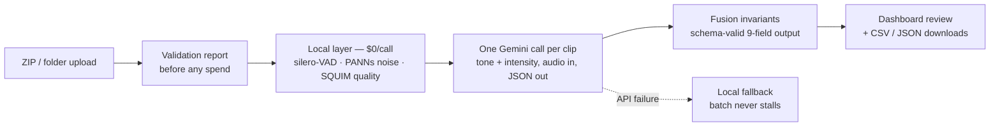

# Technical Memo — Voice Tone & Background Noise Analysis

**Date:** 2026-07-17 · **Dashboard:** https://autoace.aixcoach.in (credentials supplied separately)

---

## Executive summary

**Built:**

- ✓ Hosted dashboard — login, ZIP/folder batch upload, validation-before-processing, live per-file progress, CSV/JSON downloads
- ✓ Production analysis pipeline — 9-field JSON per call, local detectors + one focused LLM call, per-file failure isolation
- ✓ Deployed on AWS (us-east-1) behind HTTPS, survives restarts, batch history persists

**Key results (all measured, sources in-line below):**

- ✓ **Cost: $0.00146 / audio-minute** — ~49% of the $0.003 ceiling
- ✓ **Latency: ~19 s per audio-minute** end-to-end on the production box (100-call batch ≈ 95 min)
- ✓ **Accuracy: 13/15 (87%) on headline fields**, 17/24 across all fields, on the 3 labeled anchor calls
- ✓ **315 automated tests passing** at the deployed commit
- ✓ Budget study: 7 spending levers measured — **the shipping config is the accuracy-per-dollar peak**

**Known weaknesses (details in §7):**

- Speaker overlap — weakest field (2/3); diarization didn't fix it
- Emotional intensity — runs one band low, systematically
- All accuracy figures rest on **n = 3 labeled calls** — directional, not statistical

**The one-line ask:** more labeled real calls. Every measured attempt to buy
accuracy with model spend failed; labeled data is the lever that works.

---

## 1. Architecture

- **Local deterministic layer** (free): silence/long-gap (silero-VAD), noise presence/type/severity (windowed PANNs + gap-SNR), audio quality (channel checks + gated SQUIM)
- **One LLM call per clip** (`gemini-3.1-flash-lite`): tone + intensity; hard 60 s timeout, bounded retries, local fallback — one bad clip cannot stall a batch
- **Data boundary:** audio leaves the machine only for the Gemini call (paid tier — not used for training); no other third party receives audio
- Two surfaces, same engine: CLI (`python -m autoace_audio analyze <dir|zip>`) and the hosted dashboard

## 2. Accuracy

> **Read this first:** the trial supplied **3 labeled calls**. One flipped
> clip moves any per-field score by 33 points. Numbers below are honest
> measurements presented as **directional evidence** — the augmented set
> (§2.2) adds sample size where synthesis allows it.

### 2.1 Labeled anchors — per-field results

Prediction vs. label (`out/anchors_recheck/results.json` vs `data/labels.csv`):

| field | call_001 | call_002 | call_003 | score |
|---|---|---|---|---|
| emotional_tone | upset ✓ | frustrated ✗ (neutral) | satisfied ✓ | 2/3 |
| emotional_intensity | medium ✗ (high) | medium ✓ | low ✗ (medium) | 1/3 |
| background_noise_present | ✓ | ✓ | ✓ | 3/3 |
| background_noise_type | — ✓ | radio ✗ (TV) | radio ✗ (static) | 1/3 |
| background_noise_severity | none ✓ | high ✗ (medium) | medium ✓ | 2/3 |
| audio_quality | clear ✓ | clear ✓ | clear ✓ | 3/3 |
| speaker_overlap_present | ✓ | ✗ (missed) | ✓ | 2/3 |
| long_silence_present | ✓ | ✓ | ✓ | 3/3 |

**Headline fields (tone, noise presence, severity, quality, silence): 13/15 (87%).**
All comparable fields: 17/24 (71%).

Tone confusion matrix (rows = label, columns = prediction; n = 3):

| | neutral | satisfied | frustrated | upset | distressed |
|---|---|---|---|---|---|
| **neutral** | 0 | 0 | **1** | 0 | 0 |
| **satisfied** | 0 | **1** | 0 | 0 | 0 |
| **upset** | 0 | 0 | 0 | **1** | 0 |

The single tone miss (`call_002`) survived 4 prompt iterations: the model
reads one Spanish profanity phrase as decisive frustration while its own
rationale calls the rest of the call calm. Model-prior limitation or label
noise — both readings recorded (`docs/decisions.md`), neither claimed as fact.

### 2.2 Augmented validation set (adds sample size synthetically)

- ✓ **Audio-quality detectors: 100%** on the quality-labeled augmented clips (`out/validation_report.md`)
- ✗ **Synthetic noise beds: 11% presence** (1/9) — disclosed, with context: both detectors (local AED *and* LLM gap-listening) deny most synthetically SNR-mixed beds, while **both score 3/3 presence on the real noisy anchors**. Evidence so far points to synthetic mixing being adversarial rather than representative; only more real audio settles it

### 2.3 Tone-arm bake-off (`out/bakeoff.md`)

| arm | tone (n=3) | macro F1 | $/audio-min |
|---|---|---|---|
| **gemini audio** (shipping) | 2/3 | 0.667 | $0.00146 |
| dimensional (local, free) | 0/3 | 0.000 | $0 |
| transcript → LLM | 0/3 | 0.000 | $0.00065 |

At n = 3 these are illustrative rather than statistically meaningful. On
the anchor calls, the transcript-only arm underperformed the audio arm —
suggesting prosodic information (how things are said, not just what)
contributes meaningfully to tone classification. The shipping arm's only
miss is the adjudicated `call_002` above.

## 3. Cost

- **$0.00146 / audio-minute measured** — token-metered from live `usage_metadata`, not list-price arithmetic (`out/bakeoff.md`)
- Ceiling $0.003 → shipping runs at **~49% of budget**
- Local layer costs $0 per call; an independent re-measurement of the same arm produced $0.00115/audio-min — this memo quotes the **higher** figure
- Recommended production config (baseline + gap-listening, §5): **$0.00143 / audio-minute**

## 4. Latency

- **Production box** (m5.xlarge, us-east-1): 3.96-audio-min batch → **144 s wall**, incl. one-time ~70 s model load (shown in the UI as an explicit "loading models" phase)
- Steady-state: **~19 s per audio-minute** for the full 9-field pipeline
- Per-clip Gemini call: **4.7–7.2 s** (`out/bakeoff.md`)
- Throughput model: one bounded worker (~4 GB), one batch at a time, batches queue; **100-call batch ≈ 95 min**, progress survives reloads and restarts

## 5. What more budget buys — measured, not assumed

Two-phase study, 7 levers, 3 runs each, $0.16 of a $10 cap
(`docs/experiments/2026-07-17-budget-accuracy-study.md`):

| configuration | $/audio-min | outcome |
|---|---|---|
| **shipping baseline** | **$0.00146** | **accuracy-per-dollar peak** |
| + gap-listening noise question | $0.00143 | the one real win (noise class the AED misses); needs hardening |
| few-shot intensity exemplars | $0.00156 | clean null |
| devil's-advocate tone pass | $0.00215 | net negative on its target |
| 3-vote gap majority | $0.0023 | no reliability gain |
| tone self-consistency voting | $0.0035 | null, over ceiling |
| Gemini Flash (bigger model) | $0.00397 | 1 win, 2 regressions; 32% over ceiling |
| Deepgram diarization overlap | $0.0063 | 0 wins on its target field |

**Conclusion:** at this sample size, model-side spend does not buy accuracy.
The levers that credibly would:

1. **Labeled real calls** — even 30–50 turn every number here from directional to statistical; precondition for tuning anything
2. **Narrow targeted sub-questions** (the only lever class that won) — not bigger general-purpose passes (which regressed)
3. **CLAP zero-shot noise typing** (local, free) — produced the first correct "TV" on the exact `call_002` miss in evaluation; not integrated pre-submission to avoid regression risk; top candidate for the noise-type field

Also measured: confidence output is rank-informative but compressed
(0.83–0.87, σ = 0.013, 17 predictions) — use for ordering review queues;
recalibration is a post-pilot item.

## 6. Dashboard & operations

- **Stack:** FastAPI · SQLite (WAL) · detached worker per batch · React SPA (same origin) · nginx + Let's Encrypt on AWS EC2
- **Flow:** login (bcrypt + JWT) → upload → **validation report before any spend** → explicit start → live per-file progress (failures marked in place) → results table → CSV/JSON/errors downloads (original filenames preserved)
- **Robustness, each item tested:**
  - zip-slip-safe extraction; decompressed-size budget (zip-bomb guard); macOS Finder ZIP quirks handled; upload caps
  - per-file failure isolation — hard Gemini timeout + bounded retries + local fallback
  - workers survive server restarts (re-adopted by pid); batch history persists across reboots
- **315 backend/web tests + SPA unit tests**, green at the deployed commit

## 7. Honest limitations

- **n = 3 labeled calls** — the biggest caveat on every accuracy number
- **Synthetic noise beds defeat both detectors**; real noisy calls don't — unresolved without more real data
- **Overlap is an LLM judgment** (2/3); diarization failed upstream of its thresholds — a real fix likely needs channel-separated audio from the telephony stack
- **Intensity is prompt-coupled to tone** — every intensity re-wording flipped a tone anchor (measured twice); fixes must come from non-prompt levers
- **Confidence is compressed** (0.83–0.87) — ranking signal, not a calibrated probability
- **Session-to-session variance is real** — one lever measured 3/3 in one session, 1/3 in another at identical settings; claims here use the weaker measurement

---

*Every figure sources to: `out/bakeoff.md` · `out/validation_report.md` ·
`out/anchors_recheck/` · `data/labels.csv` ·
`docs/experiments/2026-07-17-budget-accuracy-study.md` · `docs/decisions.md` ·
the deployed job record (latency). Raw run logs (`out/experiments/*.json`)
carry per-clip token counts for every live call.*
